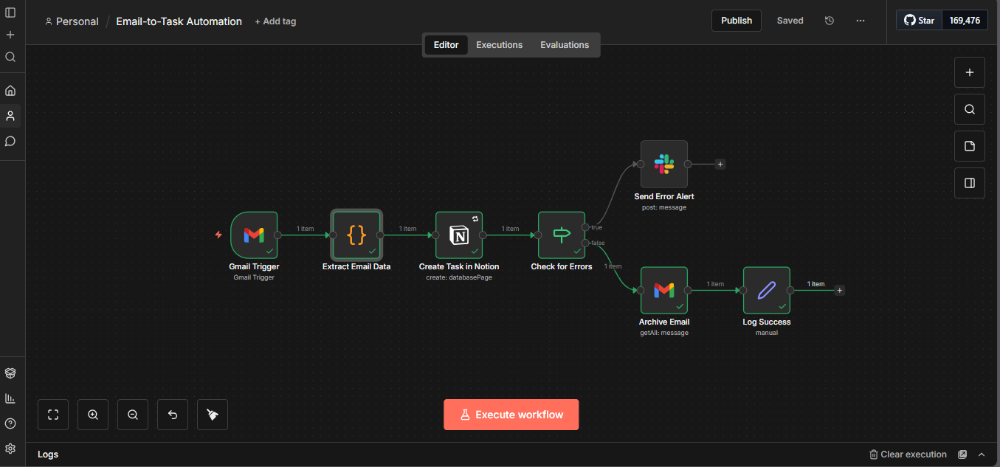

# Email-to-Task Automation

> Automated support workflow using n8n to monitor Gmail, extract request details, create tasks instantly, and notify on failure - without manual inbox triage

[](LICENSE)
[](https://n8n.io)



---

## Table of Contents

- [Overview](#overview)
- [Features](#features)
- [Demo](#demo)
- [Prerequisites](#prerequisites)
- [Installation](#installation)
- [Usage](#usage)
- [Expected Output](#expected-output)
- [Sample Data](#sample-data)
- [Troubleshooting](#troubleshooting)
- [License](#license)
- [Acknowledgments](#acknowledgments)

---

## Overview

**Problem:** IT support teams manually check email inboxes hourly, spending 5-10 hours weekly triaging requests into task management systems. This reactive approach causes missed urgent requests, inconsistent response times (30 min to 4+ hours), manual data entry errors, and no audit trail. That's 8 hours per week per coordinator - over $15,000 annually in wasted processing time.

**Solution:** This n8n workflow monitors a Gmail inbox every 5 minutes, automatically converting labeled emails into Notion tasks with smart parsing, instant creation, and auto-archiving. All conversions are logged with timestamps for a full audit trail.

**Technology:**
- n8n (workflow orchestration - self-hosted or cloud)
- Gmail API (email source and label management)
- Notion API (task destination - free tier)
- Slack API (error notifications)

---

## Features

- Automated inbox monitoring every 5 minutes
- Smart email parsing (sender, subject, priority, body)
- Instant task creation in Notion in under 30 seconds
- Auto-archiving of processed emails to "Done" label
- Duplicate prevention via email ID deduplication
- Full audit log of all email → task conversions
- Low-noise Slack alerts only on workflow failure

---

## Demo

### Audio Case Study

### Visual Demo


---

## Prerequisites

**Required:**
- **n8n instance** (self-hosted via Docker OR n8n cloud)
  - Self-hosted install: https://docs.n8n.io/hosting/installation/docker/
  - Cloud trial: https://n8n.io/cloud
- **Gmail account** with API access enabled

**For Task Creation:**
- Notion account (free tier) OR Trello account
  - Notion integration guide: https://www.notion.so/my-integrations

**Optional:**
- **Email/Slack workspace** for failure alert notifications (free)

---

## Installation

### Quick Start: Import Workflow (5 minutes)

1. **Download workflow export:**
   - Go to: [Releases](https://github.com/Dessybabybaby/email-task-automation/releases)
   - Download `email-task-workflow.json`

2. **Import to n8n:**
   - Open n8n UI
   - Click **"Workflows"** → **"Add Workflow"** → **"Import from File"**
   - Select downloaded `email-task-workflow.json`
   - Click **"Import"**

3. **Configure Gmail credentials:**
   - Click on the **"Gmail Trigger"** node
   - Click **"Select Credential"** → **"Create New"**
   - Follow the OAuth flow and authorize your account
   - Grant permissions: Read, Modify, Send
   - Click **"Save"**

4. **Configure Notion credentials:**
   - Go to https://www.notion.so/my-integrations and create a new integration
   - Copy the **Internal Integration Token**
   - In n8n: **Credentials → Add "Notion API"** → paste token
   - Share your target Notion database with the integration

5. **Set workflow variables:**
   - Open the **"Load Configuration"** node
   - Set your Notion database ID
   - Set your Gmail label name (default: `support-inbox`)

6. **Activate workflow:**
   - Toggle **Active** (top-right of n8n UI)

7. **Test manually:**
   - Send a test email to yourself and apply the `support-inbox` label
   - Click **Execute Workflow**
   - Verify the task appears in Notion and the email is archived

---

## Usage

### Automatic Execution
Workflow polls Gmail every 5 minutes automatically and processes any new emails with the configured label.

### Manual Execution
1. Open the workflow in n8n
2. Click **Execute Workflow**
3. Observe each node's execution in real time
4. Check Notion for the new task and Gmail for the archived email

### Workflow Logic

1. Gmail trigger fires on schedule (every 5 minutes)
2. Filter for emails with `support-inbox` label
3. Check if task with same email ID already exists (deduplication)
4. Parse sender, subject, body, and priority from email
5. Create task in Notion with mapped fields and timestamp
6. Archive processed email and apply `processed` label
7. On failure: catch error and send Slack alert for manual review

---

## Expected Output

**Notion Task**
```json
{
  "title": "[URGENT] VPN connection failing",
  "requester": "user@company.com",
  "priority": "High",
  "description": "I can't connect to VPN since this morning...",
  "created_at": "2026-01-17T10:30:00Z",
  "status": "To Do"
}
```

**Slack Alert (on failure)**
```
[FAILED] Email-to-Task Workflow — 2026-01-17
Reason: Notion database not found (404)
Action Required: Verify database ID and integration sharing settings
```

---

## Sample Data

Test the workflow with a sample email before going to production.

**Input Email:**
```
From:    user@company.com
Subject: [URGENT] VPN connection failing
Label:   support-inbox

Body:
Hi Support,

I can't connect to VPN since this morning. Getting error "Connection timeout".
Tried restarting but same issue.

Thanks,
John
```

Additional test cases available in [`sample-data/test-cases.md`](sample-data/test-cases.md).

---

## Troubleshooting

| Issue | Solution |
|-------|----------|
| No emails detected | Confirm Gmail label exists; verify OAuth permissions include Read |
| Task creation fails | Confirm Notion database is shared with integration; check database ID |
| Workflow times out | Increase timeout: HTTP Request node → Options → Timeout: 30000 |
| Duplicate tasks | Confirm deduplication node checks email ID before task creation |

---

## License

This project is licensed under the MIT License - see [LICENSE](LICENSE) file for details.

You are free to:
- ✓ Use commercially
- ✓ Modify
- ✓ Distribute
- ✓ Private use

---

## Acknowledgments

- Inspired by [Automate AI Consulting](https://youtube.com/@automateaiconsulting) - automation workflow content
- Built with [n8n.io](https://n8n.io) - workflow automation platform

---

## Contact & Portfolio

**Creator:** Achusi Desmond
- Portfolio: [My Story](https://achusi-desmond.vercel.app/)
- GitHub: [Dessybabybaby](https://github.com/Dessybabybaby)
- LinkedIn: [Achusi Desmond](https://linkedin.com/in/achusi-desmond)
- Email: achusidesmond4@gmail.com

---

**If this workflow saved you time, please star the repo!**
